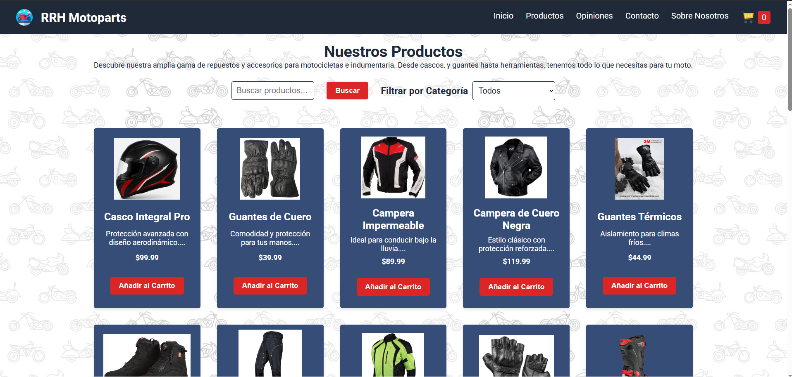
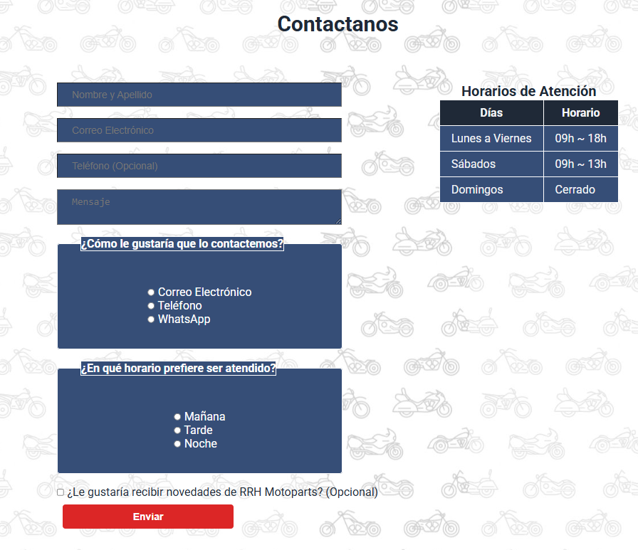

# RRH Motoparts - Proyecto Final Integrador de Talento Tech 🚴‍♂️

 
 
 


**RRH Motoparts** es el **Proyecto Final Integrador** del curso de **Front-End** de **Talento Tech**. Esta tienda en línea está diseñada para los amantes de las motocicletas, ofreciendo una experiencia de compra moderna y funcional para repuestos, accesorios e indumentaria. Con un diseño responsivo, funcionalidades dinámicas y accesibilidad optimizada, este proyecto refleja las mejores prácticas de desarrollo web aprendidas en el curso.

---

## 🌟 **Características Principales**

| **Característica**                  | **Descripción**                                                                 |
|-------------------------------------|---------------------------------------------------------------------------------|
| 🎨 **Diseño Responsivo**            | Adaptado a escritorios, tablets y móviles usando CSS Grid, Flexbox y media queries. |
| 🛒 **Carrito de Compras Dinámico**   | Añade, elimina y actualiza productos con persistencia en localStorage.           |
| 🔍 **Búsqueda y Filtro**            | Busca productos por palabra clave y filtra por categorías (Repuestos, Accesorios, Indumentaria). |
| ⭐ **Reseñas de Clientes**           | Muestra testimonios en una cuadrícula en `opiniones.html`.                       |
| ✉️ **Formulario de Contacto**       | Integrado con Formspree, con validación de campos y opción de contacto preseleccionada. |
| 📖 **Sobre Nosotros**               | Detalles sobre la historia, valores y equipo en `sobre-nosotros.html`.           |
| 🌐 **Navegación Intuitiva**         | Barra de navegación con menú desplegable en móviles para fácil acceso.           |
| ♿ **Accesibilidad**                 | HTML semántico, atributos `alt` y navegación por teclado para mayor inclusión.   |
| 🔔 **Notificaciones**               | Retroalimentación instantánea al interactuar con el carrito.                     |

### **Capturas de Pantalla**
- **Página de Inicio**  
  

- **Página de Productos**  
  

- **Página de Contacto**  
  

---

## 🛠 **Requisitos**

- **Navegador Moderno**: Chrome, Firefox, Edge o Safari (versión actualizada).
- **Conexión a Internet**: Necesaria para cargar fuentes de Google Fonts y enviar formularios vía Formspree.
- **Servidor Local**: Recomendado para pruebas (por ejemplo, Python o Live Server).

---

## 📂 **Estructura del Proyecto**

```
rrh-motoparts/
├── css/
│   └── styles.css               # Estilos responsivos con variables CSS
├── js/
│   └── app.js                   # Lógica JavaScript para funcionalidades dinámicas
├── media/
│   ├── img/
│   │   ├── iconSN/              # Íconos para navegación y pie de página
│   │   │   ├── logo.png         # Logo de la marca
│   │   │   ├── facebook.png     # Ícono de Facebook
│   │   │   ├── instagram.png    # Ícono de Instagram
│   │   │   ├── twitter.png      # Ícono de Twitter
│   │   │   └── tik-tok.png      # Ícono de TikTok
│   │   ├── productos/           # Imágenes de productos
│   │   └── fondo.jpg            # Imagen de fondo
├── screenshots/
│   ├── index.png                # Captura de la página de inicio
│   ├── productos.png            # Captura de la página de productos
│   ├── contacto.png             # Captura de la página de contacto
├── products.json                # Datos de productos en formato JSON
├── index.html                   # Página principal
├── productos.html               # Catálogo de productos
├── carrito.html                 # Carrito de compras
├── opiniones.html               # Reseñas de clientes
├── contacto.html                # Formulario de contacto
├── sobre-nosotros.html          # Información sobre la empresa
└── README.md                    # Documentación del proyecto
```

---

## ▶️ **Uso**

1. **Ejecutar el Proyecto**:

  https://raquerh.github.io/Proyecto-Final-FrontEnd-Talento-Tech/

2. **Explorar el Sitio**:
   - **Inicio**: Descubre RRH Motoparts y accede al catálogo.
   - **Productos**: Busca, filtra y añade productos al carrito.
   - **Carrito**: Gestiona tu carrito y simula un pago.
   - **Opiniones**: Lee reseñas de clientes.
   - **Contacto**: Envía consultas mediante el formulario.
   - **Sobre Nosotros**: Conoce la empresa y su ubicación.

3. **Probar el Formulario**:
   - En `contacto.html`, completa los campos (nombre, correo, mensaje).
   - La opción "Correo Electrónico" está preseleccionada.
   - Haz clic en **Enviar** y verifica la recepción en tu correo asociado con Formspree.

---

## 🐛 **Problemas y Soluciones**

- **Formulario no Envía**:
  - **Causa**: ID de Formspree incorrecta o falta de HTTPS.
  - **Solución**: Verifica la acción del formulario en `contacto.html` y usa un servidor local o despliega en Netlify.

- **Imágenes no Cargan**:
  - **Causa**: Rutas incorrectas o archivos faltantes.
  - **Solución**: Asegúrate de que las imágenes estén en `media/img/productos/` y revisa las rutas en `products.json`.

- **Diseño Desajustado en Móviles**:
  - **Causa**: Caché del navegador o modo de compatibilidad.
  - **Solución**: Limpia la caché o prueba en otro dispositivo.

- **Productos no se Muestran**:
  - **Causa**: Error en la carga de `products.json`.
  - **Solución**: Asegúrate de usar un servidor local para la solicitud `fetch`.

---

## 📧 **Contacto**

Para preguntas, sugerencias o feedback:
- **Correo Electrónico**: raquerh@gmail.com
- **GitHub Issues**: Abre un issue en el repositorio


**¡Gracias por explorar RRH Motoparts!** Este proyecto es un reflejo del aprendizaje y la pasión por el desarrollo Front-End adquiridos en el curso de **Talento Tech**. 🏍️