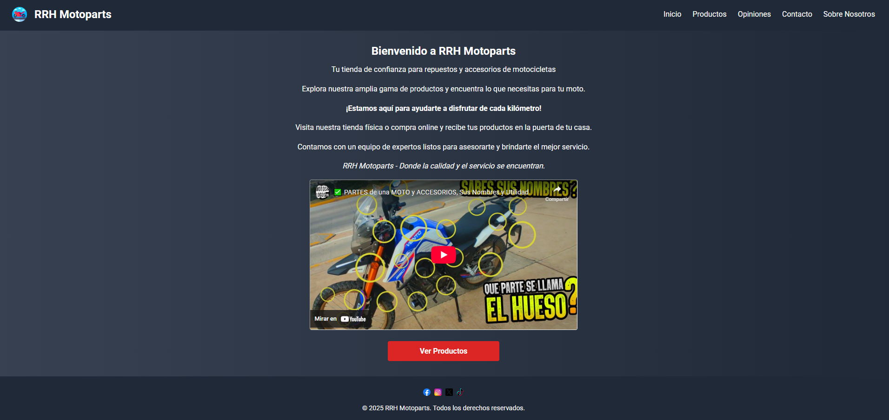
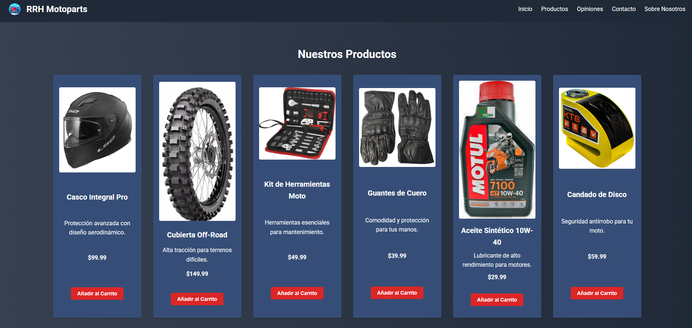
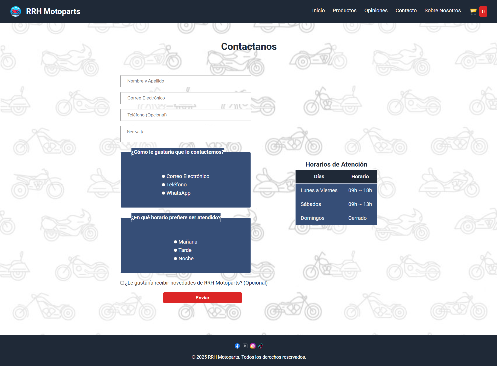

# RRH Motoparts - Proyecto Final del Curso de Front End de Talento Tech 🚀

  

**Este sitio web fue desarrollado como parte del Proyecto Final del Curso de Front End de Talento Tech.**  
Se trata de una tienda en línea responsiva para accesorios de motocicletas con un diseño moderno y funcional. Incluye páginas para explorar productos, reseñas, información de la empresa y un formulario de contacto integrado con Formspree. El sitio utiliza HTML semántico, CSS responsivo y mejores prácticas de accesibilidad, ideal para usuarios que buscan una experiencia de navegación sencilla y efectiva.

---

## 🌟 **Características Principales**

| **Característica**              | **Descripción**                                                                 |
|---------------------------------|---------------------------------------------------------------------------------|
| 🎨 **Diseño Responsivo**        | Adaptado a dispositivos de escritorio, tabletas y móviles con CSS Grid y Flexbox. |
| 🌍 **Navegación Intuitiva**     | Barra de navegación con enlaces a Inicio, Productos, Opiniones, Contacto y Sobre Nosotros. |
| 🛵 **Catálogo de Productos**    | Muestra accesorios de motocicletas con imágenes y descripciones en `productos.html`. |
| ⭐ **Reseñas de Clientes**       | Presenta testimonios en un diseño de cuadrícula en `opiniones.html`.             |
| ✉️ **Formulario de Contacto**   | Formulario integrado con Formspree, con selección predeterminada de "Correo Electrónico" y espaciado entre opciones. |
| 📖 **Sobre Nosotros**           | Sección detallada sobre la empresa en `sobre-nosotros.html`.                     |
| 🌐 **Enlaces a Redes Sociales** | Pie de página con íconos de Facebook, Instagram, Twitter y TikTok.               |
| ♿ **Accesibilidad**             | Incluye atributos `alt`, HTML semántico y navegación por teclado.                |

### **Capturas de Pantalla**
- **Página de Inicio**  
  

- **Página de Productos**  
  

- **Página de Contacto**  
  


---

## 🛠 **Requisitos**

- **Navegador Moderno**: Chrome, Firefox, Edge o Safari (versión actualizada).
- **Conexión a Internet**: Necesaria para el formulario de Formspree y carga de fuentes externas.

---

## 📂 **Estructura del Proyecto**

```
rrh-motoparts/
├── css/
│   └── styles.css               # Hoja de estilos con diseño responsivo
├── media/
│   ├── audio/                   # por el momento no tiene audio
│   ├── video/                   # por el momento no tiene video
│   └── img/
│       ├── logo.png              # Logo de la marca
│       ├── iconSN/
│       │   ├── facebook.png      # Ícono de Facebook
│       │   ├── instagram.png     # Ícono de Instagram
│       │   ├── twitter.png       # Ícono de Twitter
│       │   └── tik-tok.png       # Ícono de TikTok
│       ├── casco.jpg            # Imagen de producto (casco)
│       ├── cubierta.jpg         # Imagen de producto (cubierta)
│       ├── herramientas.jpg     # Imagen de producto (herramientas)
│       ├── guantes.jpg          # Imagen de producto (guantes)
│       ├── aceite.jpg           # Imagen de producto (aceite)
│       ├── candado.jpg          # Imagen de producto (candado)
│       ├── campera.jpg          # Imagen de producto (campera)
│       ├── filtro.jpg           # Imagen de producto (filtro)
│       ├── espejos.jpg          # Imagen de producto (espejos)
│       └── bateria.jpg          # Imagen de producto (batería)
├── screenshots/
│   ├── index.png                # Captura de la página de inicio
│   ├── productos.png            # Captura de la página de productos
│   └── contacto.png             # Captura de la página de contacto
├── index.html                   # Página principal
├── productos.html               # Catálogo de productos
├── opiniones.html               # Reseñas de clientes
├── contacto.html                # Formulario de contacto
├── sobre-nosotros.html          # Información sobre la empresa
└── README.md                    # Documentación
```

---

## ▶️ Uso
1. **Ejecuta el Proyecto**:
   - Abre `index.html` en un navegador moderno haciendo doble clic o usando un servidor local:
     - **Con Python**: `python -m http.server 8000` y visita `http://localhost:8000`.
     - **Con VS Code**: Usa la extensión Live Server y haz clic en "Open with Live Server".
   - Explora las páginas: Inicio, Productos, Opiniones, Contacto y Sobre Nosotros. 🌟

2. **Prueba el Formulario de Contacto**:
   - En `contacto.html`, completa los campos (nombre, correo, mensaje).
   - La opción "Correo Electrónico" está preseleccionada por defecto.
   - Haz clic en **Enviar** para enviar el formulario. 📧

3. **Comprobacion de Formspree**:
   - Verifica que llegue a tu correo asociado con Formspree. 🔧

---

## 🐛 Problemas y Soluciones

- **Formulario no Envía**:
  - Asegúrate de que la direccion en el formulario tiene la ID correcta de Formspree.
  - Verifica que el sitio esté alojado en HTTPS (despliegue necesario).
  - Solución: Prueba localmente con un servidor (por ejemplo, Python) y despliega en Netlify.

- **Imágenes no Cargan**:
  - Confirma que las imágenes estén en la carpeta correcta con los nombres correctos.
  - Solución: Actualiza las rutas en los archivos HTML si las moviste.

- **Diseño Desajustado en Móviles**:
  - Asegúrate de que el navegador no esté en modo de compatibilidad.
  - Solución: Limpia la caché del navegador o prueba en otro dispositivo.

---

## 📧 Contacto
Para preguntas o sugerencias, contacta a raquerh@gmail.com o abre un issue en el repositorio.  
¡Gracias por tu interés! 🚀